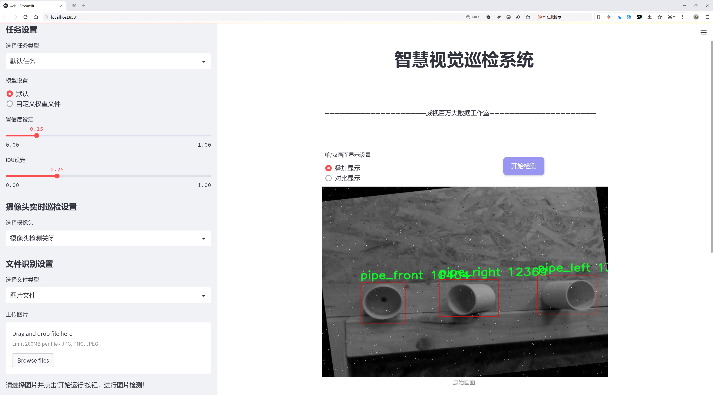
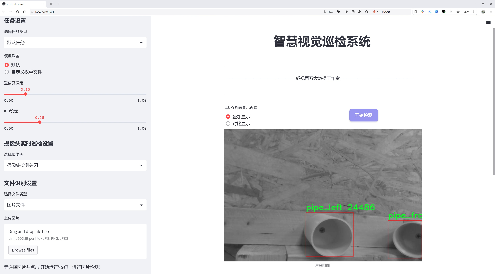
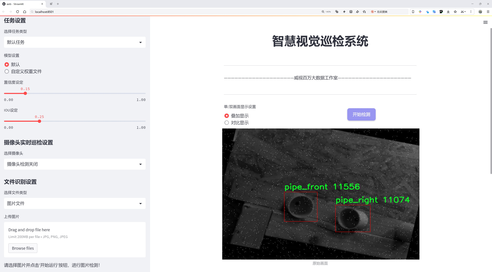
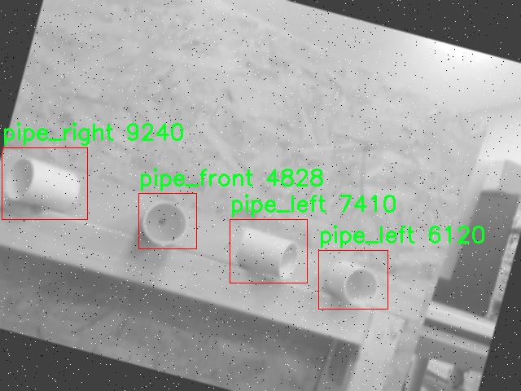
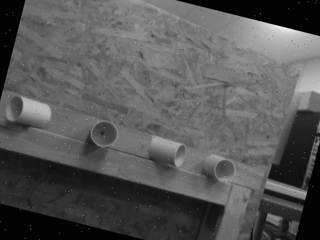
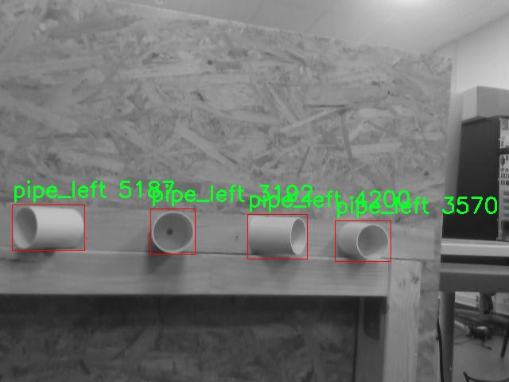
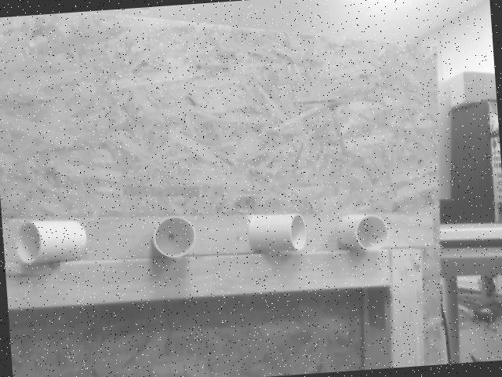
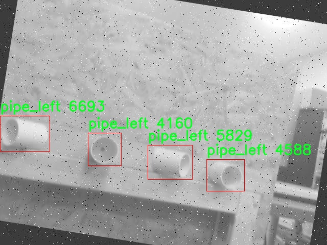

# 管道检测与识别检测系统源码分享
 # [一条龙教学YOLOV8标注好的数据集一键训练_70+全套改进创新点发刊_Web前端展示]

### 1.研究背景与意义

项目参考[AAAI Association for the Advancement of Artificial Intelligence](https://gitee.com/qunmasj/projects)

项目来源[AACV Association for the Advancement of Computer Vision](https://kdocs.cn/l/cszuIiCKVNis)

研究背景与意义

随着城市化进程的加快，地下管道的建设与维护日益成为城市管理的重要组成部分。管道作为城市基础设施的重要环节，其安全性和可靠性直接影响到城市的正常运行和居民的生活质量。然而，传统的管道检测方法往往依赖人工巡检，不仅效率低下，而且容易受到人为因素的影响，导致漏检或误检的情况发生。因此，开发一种高效、准确的管道检测与识别系统显得尤为重要。

近年来，深度学习技术的迅猛发展为目标检测领域带来了新的机遇。YOLO（You Only Look Once）系列模型因其实时性和高精度的特点，逐渐成为目标检测的主流方法。YOLOv8作为该系列的最新版本，在模型结构和算法优化上进行了多项改进，具备了更强的特征提取能力和更快的推理速度。这使得YOLOv8在复杂环境下的目标检测任务中表现出色，尤其适用于需要实时反馈的应用场景，如管道检测。

本研究旨在基于改进的YOLOv8模型，构建一个高效的管道检测与识别系统。该系统将针对特定的管道类别进行训练与优化，数据集包含2910张图像，涵盖了四种管道类别：管道前视、管道左侧、管道右侧和管道顶部。这些数据不仅为模型的训练提供了丰富的样本，也为后续的性能评估和模型优化奠定了基础。通过对这些图像的深入分析，模型能够学习到不同管道在不同视角下的特征，从而提高识别的准确性和鲁棒性。

此外，管道检测与识别系统的研究不仅具有理论意义，还具有重要的实际应用价值。通过自动化的管道检测，能够显著提高管道维护的效率，降低人工成本，减少因管道故障导致的经济损失和安全隐患。同时，该系统的推广应用将为城市基础设施的智能化管理提供有力支持，推动智慧城市的建设进程。

在研究过程中，我们还将探索改进YOLOv8模型的多种策略，如数据增强、模型剪枝和迁移学习等，以进一步提升模型的性能和适应性。这些技术的应用不仅能够提升管道检测的准确性，还能为其他领域的目标检测任务提供借鉴，推动计算机视觉技术的进一步发展。

综上所述，基于改进YOLOv8的管道检测与识别系统的研究，不仅填补了现有技术在管道检测领域的空白，也为城市基础设施的智能化管理提供了新的解决方案。通过这一研究，我们期望能够为管道检测技术的发展贡献一份力量，同时为相关领域的研究者提供参考与启示。

### 2.图片演示







##### 注意：由于此博客编辑较早，上面“2.图片演示”和“3.视频演示”展示的系统图片或者视频可能为老版本，新版本在老版本的基础上升级如下：（实际效果以升级的新版本为准）

  （1）适配了YOLOV8的“目标检测”模型和“实例分割”模型，通过加载相应的权重（.pt）文件即可自适应加载模型。

  （2）支持“图片识别”、“视频识别”、“摄像头实时识别”三种识别模式。

  （3）支持“图片识别”、“视频识别”、“摄像头实时识别”三种识别结果保存导出，解决手动导出（容易卡顿出现爆内存）存在的问题，识别完自动保存结果并导出到tempDir中。

  （4）支持Web前端系统中的标题、背景图等自定义修改，后面提供修改教程。

  另外本项目提供训练的数据集和训练教程,暂不提供权重文件（best.pt）,需要您按照教程进行训练后实现图片演示和Web前端界面演示的效果。

### 3.视频演示

[3.1 视频演示](https://www.bilibili.com/video/BV1W2sUeAELs/)

### 4.数据集信息展示

##### 4.1 本项目数据集详细数据（类别数＆类别名）

nc: 4
names: ['pipe_front', 'pipe_left', 'pipe_right', 'pipe_top']


##### 4.2 本项目数据集信息介绍

数据集信息展示

在现代计算机视觉领域，尤其是在管道检测与识别的应用中，数据集的质量和多样性直接影响到模型的性能和泛化能力。本研究所采用的数据集名为“Pipes”，该数据集专门设计用于训练和改进YOLOv8的管道检测与识别系统。通过对该数据集的深入分析，我们可以更好地理解其在模型训练中的重要性及其潜在应用。

“Pipes”数据集包含四个主要类别，分别是“pipe_front”、“pipe_left”、“pipe_right”和“pipe_top”。这些类别的设计考虑到了管道在实际应用中的不同视角和方位，确保模型能够在多种场景下有效识别和定位管道。具体而言，“pipe_front”类别主要关注管道的正面视图，适用于需要从正面进行检测的场景；“pipe_left”和“pipe_right”则分别对应管道的左侧和右侧视图，能够帮助模型在不同角度下识别管道的存在；而“pipe_top”则代表从上方俯视管道的情况，适合于那些需要从高处进行监测的应用场景。

数据集的构建过程中，考虑到了多样性和代表性。每个类别的样本均经过精心挑选，确保涵盖了各种管道的形状、尺寸、材质和环境背景。这种多样性不仅增强了数据集的丰富性，也为模型提供了更广泛的学习基础，使其能够在面对不同条件时保持较高的识别准确率。此外，数据集中的图像经过标注，包含了每个管道实例的边界框信息，便于模型进行目标检测任务的训练。

在数据集的规模方面，“Pipes”数据集的样本数量经过精心设计，以确保模型能够在训练过程中获得足够的样本信息，从而有效学习到管道的特征。这种平衡的样本分布，有助于避免模型在某一类别上过拟合，同时提升其在其他类别上的识别能力。数据集的构建者还考虑到了数据增强技术的应用，通过旋转、缩放、翻转等方式，进一步丰富了数据集的样本，使得模型在训练时能够接触到更多的变异情况。

在实际应用中，经过“Pipes”数据集训练的YOLOv8模型，能够在复杂的环境中实现高效的管道检测与识别。这一能力对于工业监测、城市基础设施管理以及环境保护等领域具有重要意义。通过实时监测管道的状态，能够及时发现潜在的泄漏或损坏，从而降低维护成本，提升安全性。

综上所述，“Pipes”数据集不仅为YOLOv8的管道检测与识别系统提供了坚实的基础，也为相关领域的研究与应用开辟了新的可能性。通过不断优化和扩展数据集，我们期望能够进一步提升模型的性能，使其在更广泛的应用场景中发挥作用。











### 5.全套项目环境部署视频教程（零基础手把手教学）

[5.1 环境部署教程链接（零基础手把手教学）](https://www.ixigua.com/7404473917358506534?logTag=c807d0cbc21c0ef59de5)


[5.2 安装Python虚拟环境创建和依赖库安装视频教程链接（零基础手把手教学）](https://www.ixigua.com/7404474678003106304?logTag=1f1041108cd1f708b01a)

### 6.手把手YOLOV8训练视频教程（零基础小白有手就能学会）

[6.1 手把手YOLOV8训练视频教程（零基础小白有手就能学会）](https://www.ixigua.com/7404477157818401292?logTag=d31a2dfd1983c9668658)

### 7.70+种全套YOLOV8创新点代码加载调参视频教程（一键加载写好的改进模型的配置文件）

[7.1 70+种全套YOLOV8创新点代码加载调参视频教程（一键加载写好的改进模型的配置文件）](https://www.ixigua.com/7404478314661806627?logTag=29066f8288e3f4eea3a4)

### 8.70+种全套YOLOV8创新点原理讲解（非科班也可以轻松写刊发刊，V10版本正在科研待更新）

由于篇幅限制，每个创新点的具体原理讲解就不一一展开，具体见下列网址中的创新点对应子项目的技术原理博客网址【Blog】：


[8.1 70+种全套YOLOV8创新点原理讲解链接](https://gitee.com/qunmasj/good)

### 9.系统功能展示（检测对象为举例，实际内容以本项目数据集为准）

图9.1.系统支持检测结果表格显示

  图9.2.系统支持置信度和IOU阈值手动调节

  图9.3.系统支持自定义加载权重文件best.pt(需要你通过步骤5中训练获得)

  图9.4.系统支持摄像头实时识别

  图9.5.系统支持图片识别

  图9.6.系统支持视频识别

  图9.7.系统支持识别结果文件自动保存

  图9.8.系统支持Excel导出检测结果数据


### 10.原始YOLOV8算法原理

原始YOLOv8算法原理

YOLOv8算法作为目标检测领域的一项重要创新，代表了YOLO系列算法的又一次重大进步。它不仅在速度和精度上取得了显著提升，还在网络结构和损失函数设计上进行了深刻的优化，旨在满足现代计算机视觉任务日益增长的需求。YOLOv8的设计理念是快速、准确且易于使用，使其成为广泛应用于目标检测、图像分割和图像分类等任务的理想选择。

首先，YOLOv8在输入图像的处理上引入了自适应缩放机制，默认的输入尺寸为640x640像素。然而，在实际应用中，图像的长宽比往往各不相同。为了提高目标检测的效率，YOLOv8采用了一种创新的缩放策略：将图像的长边按比例缩小至指定尺寸，然后对短边进行填充。这种方法有效减少了信息冗余，确保了模型在处理不同尺寸图像时的灵活性。此外，在训练阶段，YOLOv8还引入了Mosaic图像增强技术，通过将四张不同的训练图像随机缩放并拼接成一张新图像，迫使模型学习到不同位置和周围像素的特征，从而提高了模型的泛化能力和预测精度。

在网络结构方面，YOLOv8的主干网络（Backbone）采用了C2F模块，这一模块是对YOLOv5中C3模块的优化。C2F模块通过并行化更多的梯度流分支，既保持了网络的轻量化，又提升了特征提取的丰富性和精度。与C3模块相比，C2F模块在保证性能的同时，降低了计算复杂度，使得YOLOv8在处理大规模数据时依然能够保持高效。

YOLOv8的Neck部分同样经历了重要的变革。该部分去除了YOLOv5中两次上采样之前的1x1卷积连接层，直接对主干网络不同阶段输出的特征进行上采样。这一改进不仅简化了网络结构，还加快了特征融合的速度，使得模型在特征传递过程中更为高效。

在头部结构（Head）方面，YOLOv8的变化尤为显著。它从耦合头（Coupled-Head）转变为解耦头（Decoupled-Head），将检测和分类的卷积过程分开。通过先对输入特征图进行降维处理，YOLOv8分别为类别预测和边界框回归设计了独立的卷积路径。这种解耦设计不仅提高了模型的可解释性，还增强了目标检测的精度。此外，YOLOv8在损失函数的设计上也进行了创新，采用了分布焦点损失（DFL）和CIoU损失，以便更好地聚焦于标签附近的数值，从而提升边界框的回归精度。

值得注意的是，YOLOv8摒弃了传统的基于锚框（Anchor-Based）的方法，转而采用无锚框（Anchor-Free）策略。这一策略将目标检测转化为关键点检测，避免了在训练前对锚框进行预设的复杂过程，显著提升了模型的灵活性和泛化能力。无锚框方法使得YOLOv8能够更好地适应不同的数据集和目标物体，简化了网络框架。

YOLOv8在性能上也取得了显著的提升。与之前的YOLO版本相比，它在COCOval2017数据集上的表现更加出色，精度和帧率均有显著提高。这使得YOLOv8在智能监控、自动驾驶、人脸识别等多种应用场景中都能展现出优异的性能。

综上所述，YOLOv8算法通过对网络结构的优化、损失函数的创新以及输入处理的灵活性，成功地提升了目标检测的精度和速度。其在特征提取、特征融合和目标定位等方面的改进，使得YOLOv8不仅在理论上具有重要意义，也在实际应用中展现出广泛的适用性和高效性。随着YOLOv8的不断发展和应用，目标检测技术将迎来更加广阔的前景，为各类智能应用提供更为强大的支持。


### 11.项目核心源码讲解（再也不用担心看不懂代码逻辑）

#### 11.1 ui.py

以下是经过简化和注释的核心代码部分：

```python
import sys
import subprocess
from QtFusion.path import abs_path

def run_script(script_path):
    """
    使用当前 Python 环境运行指定的脚本。

    Args:
        script_path (str): 要运行的脚本路径
    """
    # 获取当前 Python 解释器的路径
    python_path = sys.executable

    # 构建运行命令，使用 streamlit 运行指定的脚本
    command = f'"{python_path}" -m streamlit run "{script_path}"'

    # 执行命令，并捕获结果
    result = subprocess.run(command, shell=True)
    
    # 检查命令执行结果，如果返回码不为0，则表示出错
    if result.returncode != 0:
        print("脚本运行出错。")

# 主程序入口
if __name__ == "__main__":
    # 获取脚本的绝对路径
    script_path = abs_path("web.py")

    # 运行指定的脚本
    run_script(script_path)
```

### 代码分析与注释：

1. **导入模块**：
   - `sys`：用于访问与 Python 解释器相关的变量和函数。
   - `subprocess`：用于执行外部命令。
   - `abs_path`：从 `QtFusion.path` 模块导入的函数，用于获取文件的绝对路径。

2. **`run_script` 函数**：
   - 该函数接受一个脚本路径作为参数，并使用当前 Python 环境来运行该脚本。
   - 使用 `sys.executable` 获取当前 Python 解释器的路径，以确保使用正确的 Python 版本。
   - 构建命令字符串，使用 `streamlit` 运行指定的脚本。
   - 使用 `subprocess.run` 执行命令，并通过 `shell=True` 允许在 shell 中执行。
   - 检查命令的返回码，如果不为0，表示脚本运行失败，打印错误信息。

3. **主程序入口**：
   - 使用 `if __name__ == "__main__":` 确保只有在直接运行该脚本时才会执行以下代码。
   - 调用 `abs_path` 函数获取 `web.py` 的绝对路径。
   - 调用 `run_script` 函数来运行该脚本。 

通过这些注释，代码的核心功能和逻辑变得更加清晰。

这个程序文件 `ui.py` 的主要功能是运行一个指定的 Python 脚本，具体来说是使用 Streamlit 框架来启动一个 Web 应用。程序首先导入了必要的模块，包括 `sys`、`os` 和 `subprocess`，以及一个自定义的路径处理函数 `abs_path`。

在 `run_script` 函数中，程序接收一个参数 `script_path`，这个参数是要运行的脚本的路径。函数内部首先获取当前 Python 解释器的路径，这样可以确保使用正确的 Python 环境来执行脚本。接着，程序构建了一个命令字符串，这个命令将调用 Streamlit 运行指定的脚本。命令的格式是 `python -m streamlit run "script_path"`，其中 `script_path` 是传入的脚本路径。

随后，程序使用 `subprocess.run` 方法来执行这个命令。`shell=True` 参数表示命令将在一个新的 shell 中执行。执行完命令后，程序检查返回的状态码，如果返回码不为 0，说明脚本运行出错，程序会打印出错误信息。

在文件的最后部分，程序通过 `if __name__ == "__main__":` 判断是否是直接运行该脚本。如果是，它会调用 `abs_path` 函数来获取 `web.py` 脚本的绝对路径，并将其传递给 `run_script` 函数以启动 Web 应用。

总的来说，这个文件的作用是为一个 Streamlit 应用提供一个启动入口，通过命令行调用指定的 Python 脚本来运行 Web 应用。

#### 11.2 70+种YOLOv8算法改进源码大全和调试加载训练教程（非必要）\ultralytics\utils\callbacks\tensorboard.py

以下是经过简化和注释的核心代码部分：

```python
# 导入必要的库
from ultralytics.utils import LOGGER, SETTINGS, TESTS_RUNNING, colorstr

try:
    # 尝试导入TensorBoard的SummaryWriter
    from torch.utils.tensorboard import SummaryWriter

    # 确保当前不是在测试运行中
    assert not TESTS_RUNNING  
    # 确保TensorBoard集成已启用
    assert SETTINGS['tensorboard'] is True  
    WRITER = None  # 初始化TensorBoard的SummaryWriter实例

except (ImportError, AssertionError, TypeError):
    # 处理导入错误或断言错误
    SummaryWriter = None  # 如果导入失败，则将SummaryWriter设置为None


def _log_scalars(scalars, step=0):
    """将标量值记录到TensorBoard中。"""
    if WRITER:  # 如果WRITER存在
        for k, v in scalars.items():  # 遍历标量字典
            WRITER.add_scalar(k, v, step)  # 记录每个标量


def _log_tensorboard_graph(trainer):
    """将模型图记录到TensorBoard中。"""
    try:
        import warnings
        from ultralytics.utils.torch_utils import de_parallel, torch

        imgsz = trainer.args.imgsz  # 获取输入图像大小
        imgsz = (imgsz, imgsz) if isinstance(imgsz, int) else imgsz  # 确保图像大小为元组
        p = next(trainer.model.parameters())  # 获取模型参数以确定设备和类型
        im = torch.zeros((1, 3, *imgsz), device=p.device, dtype=p.dtype)  # 创建输入图像（必须为零）

        with warnings.catch_warnings():
            warnings.simplefilter('ignore', category=UserWarning)  # 忽略JIT跟踪警告
            WRITER.add_graph(torch.jit.trace(de_parallel(trainer.model), im, strict=False), [])  # 记录模型图
    except Exception as e:
        LOGGER.warning(f'WARNING ⚠️ TensorBoard图形可视化失败 {e}')  # 记录警告


def on_pretrain_routine_start(trainer):
    """初始化TensorBoard记录。"""
    if SummaryWriter:  # 如果SummaryWriter存在
        try:
            global WRITER
            WRITER = SummaryWriter(str(trainer.save_dir))  # 创建SummaryWriter实例
            prefix = colorstr('TensorBoard: ')
            LOGGER.info(f"{prefix}开始使用 'tensorboard --logdir {trainer.save_dir}'，在 http://localhost:6006/ 查看。")
        except Exception as e:
            LOGGER.warning(f'WARNING ⚠️ TensorBoard未正确初始化，未记录此次运行。 {e}')  # 记录警告


def on_train_start(trainer):
    """在训练开始时记录TensorBoard图形。"""
    if WRITER:  # 如果WRITER存在
        _log_tensorboard_graph(trainer)  # 记录模型图


def on_batch_end(trainer):
    """在训练批次结束时记录标量统计信息。"""
    _log_scalars(trainer.label_loss_items(trainer.tloss, prefix='train'), trainer.epoch + 1)  # 记录训练损失


def on_fit_epoch_end(trainer):
    """在训练周期结束时记录周期指标。"""
    _log_scalars(trainer.metrics, trainer.epoch + 1)  # 记录训练指标


# 定义回调函数字典，如果SummaryWriter存在则添加回调
callbacks = {
    'on_pretrain_routine_start': on_pretrain_routine_start,
    'on_train_start': on_train_start,
    'on_fit_epoch_end': on_fit_epoch_end,
    'on_batch_end': on_batch_end
} if SummaryWriter else {}
```

### 代码说明：
1. **导入部分**：导入必要的库和模块，特别是TensorBoard的`SummaryWriter`，用于记录训练过程中的标量和图形信息。
2. **异常处理**：在导入`SummaryWriter`时进行异常处理，以确保在不支持的环境中不会导致程序崩溃。
3. **记录标量**：`_log_scalars`函数用于将标量值（如损失、准确率等）记录到TensorBoard中。
4. **记录模型图**：`_log_tensorboard_graph`函数用于记录模型的计算图，以便在TensorBoard中可视化。
5. **回调函数**：定义了一系列回调函数，在训练的不同阶段（如开始训练、结束批次、结束周期等）执行相应的记录操作。
6. **回调字典**：根据`SummaryWriter`的存在与否，动态构建回调函数字典，以便在训练过程中调用。

这个程序文件是用于在Ultralytics YOLO框架中集成TensorBoard的功能，主要负责记录训练过程中的各种指标和模型图形，以便于后续的可视化和分析。

文件开头引入了一些必要的模块和库，包括日志记录器、设置参数和颜色字符串等。接着，尝试导入`torch.utils.tensorboard`中的`SummaryWriter`，这是TensorBoard的核心组件，用于记录和保存训练过程中的数据。如果导入失败，或者在测试运行时，或者设置中未启用TensorBoard，则会捕获异常并将`SummaryWriter`设置为`None`。

在文件中定义了几个函数。`_log_scalars`函数用于将标量值记录到TensorBoard中，接受一个字典类型的参数`scalars`和一个步数参数`step`。如果`WRITER`实例存在，就会遍历字典中的每一项并将其添加到TensorBoard中。

`_log_tensorboard_graph`函数用于将模型的计算图记录到TensorBoard。它首先获取输入图像的尺寸，然后创建一个全零的张量作为输入。接着，使用`torch.jit.trace`对模型进行跟踪，并将生成的图形添加到TensorBoard中。如果过程中出现任何异常，则会记录警告信息。

`on_pretrain_routine_start`函数在训练前初始化TensorBoard的记录功能，创建`SummaryWriter`实例并输出相关信息，提示用户如何启动TensorBoard并查看日志。

`on_train_start`函数在训练开始时调用，用于记录模型的计算图。

`on_batch_end`函数在每个训练批次结束时调用，记录当前批次的损失值。

`on_fit_epoch_end`函数在每个训练周期结束时调用，记录该周期的指标。

最后，文件定义了一个回调字典`callbacks`，将上述函数与相应的事件关联起来，只有在`SummaryWriter`存在的情况下才会创建这个字典。这样，在训练过程中可以根据不同的事件触发相应的记录操作，以便于在TensorBoard中查看训练进度和效果。

#### 11.3 code\ultralytics\utils\errors.py

```python
# 导入Ultralytics库中的emojis工具
from ultralytics.utils import emojis

class HUBModelError(Exception):
    """
    自定义异常类，用于处理与Ultralytics YOLO模型获取相关的错误。

    当请求的模型未找到或无法检索时，将引发此异常。
    消息经过处理，以包含表情符号，以改善用户体验。

    属性:
        message (str): 当异常被引发时显示的错误消息。

    注意:
        消息会通过'ultralytics.utils'包中的'emojis'函数自动处理。
    """

    def __init__(self, message="Model not found. Please check model URL and try again."):
        """当模型未找到时创建异常。"""
        # 调用父类的构造函数，并将处理过的消息传递给它
        super().__init__(emojis(message))
```

### 代码核心部分及注释说明：
1. **导入emojis工具**：用于将文本消息转换为包含表情符号的格式，增强用户体验。
2. **HUBModelError类**：自定义异常类，继承自Python内置的Exception类，用于处理模型获取错误。
3. **构造函数__init__**：
   - 接受一个可选的消息参数，默认值为“Model not found. Please check model URL and try again.”。
   - 调用父类的构造函数，使用emojis函数处理消息，使其包含表情符号。

这个程序文件定义了一个自定义异常类 `HUBModelError`，用于处理与 Ultralytics YOLO 模型获取相关的错误。该异常类主要用于在请求的模型未找到或无法检索时抛出异常，提供了更友好的用户体验。

在文件的开头，首先引入了 `emojis` 函数，这个函数来自 `ultralytics.utils` 包，主要用于处理消息中的表情符号。接着，定义了 `HUBModelError` 类，该类继承自 Python 的内置 `Exception` 类。

类的文档字符串详细说明了该异常的用途和属性。它指出，当请求的模型无法找到时，将会抛出这个异常，并且异常消息会经过 `emojis` 函数处理，以便在显示时包含表情符号，从而提升用户体验。

在 `__init__` 方法中，定义了一个默认的错误消息：“Model not found. Please check model URL and try again.”，表示模型未找到，建议用户检查模型的 URL 并重试。调用 `super().__init__(emojis(message))` 将处理后的消息传递给父类的构造函数，以确保异常能够正确地被抛出并显示。

总的来说，这个文件的主要功能是提供一个清晰、友好的方式来处理与模型获取相关的错误，帮助开发者更好地调试和用户更好地理解问题。

#### 11.4 train.py

以下是经过简化和注释的核心代码部分：

```python
import random
import numpy as np
import torch.nn as nn
from ultralytics.data import build_dataloader, build_yolo_dataset
from ultralytics.engine.trainer import BaseTrainer
from ultralytics.models import yolo
from ultralytics.nn.tasks import DetectionModel
from ultralytics.utils import LOGGER, RANK
from ultralytics.utils.torch_utils import de_parallel, torch_distributed_zero_first

class DetectionTrainer(BaseTrainer):
    """
    基于检测模型的训练类，继承自BaseTrainer类。
    """

    def build_dataset(self, img_path, mode="train", batch=None):
        """
        构建YOLO数据集。

        参数:
            img_path (str): 图像文件夹的路径。
            mode (str): 模式，可以是'train'或'val'，用于不同的数据增强。
            batch (int, optional): 批次大小，仅用于'rect'模式。默认为None。
        """
        gs = max(int(de_parallel(self.model).stride.max() if self.model else 0), 32)  # 获取模型的最大步幅
        return build_yolo_dataset(self.args, img_path, batch, self.data, mode=mode, rect=mode == "val", stride=gs)

    def get_dataloader(self, dataset_path, batch_size=16, rank=0, mode="train"):
        """构建并返回数据加载器。"""
        assert mode in ["train", "val"]  # 确保模式有效
        with torch_distributed_zero_first(rank):  # 仅在DDP中初始化数据集
            dataset = self.build_dataset(dataset_path, mode, batch_size)  # 构建数据集
        shuffle = mode == "train"  # 训练模式下打乱数据
        workers = self.args.workers if mode == "train" else self.args.workers * 2  # 设置工作线程数
        return build_dataloader(dataset, batch_size, workers, shuffle, rank)  # 返回数据加载器

    def preprocess_batch(self, batch):
        """对图像批次进行预处理，包括缩放和转换为浮点数。"""
        batch["img"] = batch["img"].to(self.device, non_blocking=True).float() / 255  # 转换为浮点数并归一化
        if self.args.multi_scale:  # 如果启用多尺度
            imgs = batch["img"]
            sz = (
                random.randrange(self.args.imgsz * 0.5, self.args.imgsz * 1.5 + self.stride)
                // self.stride
                * self.stride
            )  # 随机选择图像大小
            sf = sz / max(imgs.shape[2:])  # 计算缩放因子
            if sf != 1:
                ns = [
                    math.ceil(x * sf / self.stride) * self.stride for x in imgs.shape[2:]
                ]  # 计算新的形状
                imgs = nn.functional.interpolate(imgs, size=ns, mode="bilinear", align_corners=False)  # 进行插值
            batch["img"] = imgs  # 更新批次图像
        return batch

    def get_model(self, cfg=None, weights=None, verbose=True):
        """返回YOLO检测模型。"""
        model = DetectionModel(cfg, nc=self.data["nc"], verbose=verbose and RANK == -1)  # 创建检测模型
        if weights:
            model.load(weights)  # 加载权重
        return model

    def plot_training_samples(self, batch, ni):
        """绘制带有注释的训练样本。"""
        plot_images(
            images=batch["img"],
            batch_idx=batch["batch_idx"],
            cls=batch["cls"].squeeze(-1),
            bboxes=batch["bboxes"],
            paths=batch["im_file"],
            fname=self.save_dir / f"train_batch{ni}.jpg",
            on_plot=self.on_plot,
        )

    def plot_metrics(self):
        """从CSV文件中绘制指标。"""
        plot_results(file=self.csv, on_plot=self.on_plot)  # 保存结果图
```

### 代码注释说明：
1. **导入模块**：导入必要的库和模块，包括数据处理、模型构建和工具函数。
2. **DetectionTrainer类**：定义一个继承自`BaseTrainer`的类，用于训练YOLO检测模型。
3. **build_dataset方法**：构建YOLO数据集，支持训练和验证模式，允许不同的数据增强。
4. **get_dataloader方法**：构建数据加载器，支持分布式训练。
5. **preprocess_batch方法**：对输入的图像批次进行预处理，包括归一化和可选的多尺度调整。
6. **get_model方法**：创建并返回YOLO检测模型，支持加载预训练权重。
7. **plot_training_samples方法**：绘制训练样本及其对应的注释，便于可视化训练过程。
8. **plot_metrics方法**：从CSV文件中绘制训练指标，便于监控训练效果。

这个程序文件 `train.py` 是一个用于训练 YOLO（You Only Look Once）目标检测模型的脚本，基于 Ultralytics 的实现。程序主要包含一个名为 `DetectionTrainer` 的类，该类继承自 `BaseTrainer`，专门用于处理目标检测任务。

在这个类中，首先定义了 `build_dataset` 方法，用于构建 YOLO 数据集。该方法接收图像路径、模式（训练或验证）和批次大小作为参数，使用 `build_yolo_dataset` 函数来生成数据集，并根据模型的步幅设置进行调整。

接着，`get_dataloader` 方法用于构建数据加载器。它会根据传入的模式（训练或验证）初始化数据集，并设置是否打乱数据的顺序。该方法还会根据训练模式的不同，调整工作线程的数量。

`preprocess_batch` 方法用于对每个批次的图像进行预处理，包括缩放和转换为浮点数格式。它还支持多尺度训练，通过随机选择图像的大小来增强模型的鲁棒性。

`set_model_attributes` 方法用于设置模型的属性，包括类别数量和类别名称。这些信息是从数据集中提取的，并被附加到模型中，以便于后续的训练和验证。

`get_model` 方法用于返回一个 YOLO 检测模型的实例。它可以根据配置文件和权重文件来加载模型。

`get_validator` 方法返回一个用于模型验证的 `DetectionValidator` 实例，负责计算和记录模型在验证集上的表现。

`label_loss_items` 方法用于返回一个包含训练损失项的字典，这在目标检测中是必要的，因为它需要跟踪多个损失项。

`progress_string` 方法返回一个格式化的字符串，显示训练进度，包括当前的轮次、GPU 内存使用情况、损失值、实例数量和图像大小等信息。

`plot_training_samples` 方法用于绘制训练样本及其标注，生成的图像会保存到指定的目录中。

最后，`plot_metrics` 和 `plot_training_labels` 方法分别用于绘制训练过程中的指标和生成带有标注的训练图像。这些方法利用 `plot_results` 和 `plot_labels` 函数来实现可视化。

整体来看，这个程序文件实现了 YOLO 模型的训练流程，包括数据集构建、数据加载、图像预处理、模型设置、训练过程监控和结果可视化等功能。

#### 11.5 code\train.py

以下是经过简化和注释的核心代码部分：

```python
import os
import torch
import yaml
from ultralytics import YOLO  # 导入YOLO模型库
from QtFusion.path import abs_path  # 导入路径处理函数

# 设置设备为GPU（如果可用），否则使用CPU
device = "0" if torch.cuda.is_available() else "cpu"

if __name__ == '__main__':  # 确保该模块被直接运行时才执行以下代码
    # 定义工作进程数量和批次大小
    workers = 1
    batch = 2

    # 定义数据集名称
    data_name = "data"
    # 获取数据集配置文件的绝对路径
    data_path = abs_path(f'datasets/{data_name}/{data_name}.yaml', path_type='current')
    
    # 获取数据集目录路径
    directory_path = os.path.dirname(data_path)
    
    # 读取YAML配置文件
    with open(data_path, 'r') as file:
        data = yaml.load(file, Loader=yaml.FullLoader)
    
    # 如果YAML文件中包含'path'项，则修改为当前目录路径
    if 'path' in data:
        data['path'] = directory_path
        # 将修改后的数据写回YAML文件
        with open(data_path, 'w') as file:
            yaml.safe_dump(data, file, sort_keys=False)

    # 加载YOLOv8模型
    model = YOLO(model='./ultralytics/cfg/models/v8/yolov8s.yaml', task='detect')
    
    # 开始训练模型
    results2 = model.train(
        data=data_path,  # 指定训练数据的配置文件路径
        device=device,  # 指定训练设备
        workers=workers,  # 指定工作进程数量
        imgsz=640,  # 输入图像大小
        epochs=100,  # 训练的轮数
        batch=batch,  # 每个批次的大小
        name='train_v8_' + data_name  # 训练任务名称
    )
```

### 代码注释说明：
1. **导入库**：导入必要的库，包括操作系统相关的`os`、深度学习框架`torch`、YAML文件处理库`yaml`和YOLO模型库。
2. **设备选择**：根据是否有可用的GPU，选择训练设备为GPU或CPU。
3. **主程序入口**：使用`if __name__ == '__main__':`确保只有在直接运行该脚本时才执行后续代码。
4. **参数设置**：定义工作进程数量和批次大小，便于后续训练配置。
5. **数据集路径处理**：根据数据集名称构建数据集配置文件的绝对路径，并提取其目录路径。
6. **读取和修改YAML文件**：读取YAML配置文件，检查并更新其中的`path`项为当前目录路径，然后将修改后的内容写回文件。
7. **模型加载**：加载YOLOv8模型，准备进行目标检测任务。
8. **模型训练**：调用`train`方法开始训练，传入数据路径、设备、工作进程数量、图像大小、训练轮数、批次大小和任务名称等参数。

这个程序文件 `train.py` 主要用于训练一个YOLOv8目标检测模型。首先，它导入了必要的库，包括 `os`、`torch`、`yaml` 和 `ultralytics` 中的 YOLO 模型。程序会检查当前是否有可用的GPU，如果有，则使用GPU进行训练，否则使用CPU。

在 `__main__` 代码块中，程序设置了一些训练参数，包括工作进程数和批次大小。接着，程序定义了数据集的名称，并构建了数据集配置文件的绝对路径。这个路径是通过调用 `abs_path` 函数获取的，确保路径格式统一为Unix风格。

程序读取指定的YAML文件，保持原有的顺序，并检查是否存在 `path` 项。如果存在，程序会将其更新为数据集目录的路径，并将修改后的内容写回到YAML文件中。这一步是为了确保YOLO模型能够正确找到数据集。

随后，程序加载了预训练的YOLOv8模型，指定了模型的配置文件路径。接下来，程序调用 `model.train` 方法开始训练模型。在训练过程中，程序会使用之前设置的参数，包括数据配置文件路径、设备类型、工作进程数、输入图像大小、训练的epoch数量和批次大小。同时，训练任务的名称也会根据数据集名称进行命名。

总体来说，这个程序文件实现了YOLOv8模型的训练过程，涵盖了数据集路径的处理、模型的加载以及训练参数的设置。

#### 11.6 70+种YOLOv8算法改进源码大全和调试加载训练教程（非必要）\ultralytics\models\sam\modules\sam.py

以下是代码中最核心的部分，并附上详细的中文注释：

```python
import torch
from torch import nn

class Sam(nn.Module):
    """
    Sam (Segment Anything Model) 是一个用于对象分割任务的模型。它使用图像编码器生成图像嵌入，并使用提示编码器对各种类型的输入提示进行编码。这些嵌入随后被掩码解码器用于预测对象掩码。
    """

    def __init__(
        self,
        image_encoder: ImageEncoderViT,  # 图像编码器，用于将图像编码为嵌入
        prompt_encoder: PromptEncoder,     # 提示编码器，用于编码输入提示
        mask_decoder: MaskDecoder,         # 掩码解码器，用于从图像嵌入和编码的提示中预测掩码
        pixel_mean: List[float] = (123.675, 116.28, 103.53),  # 图像归一化的均值
        pixel_std: List[float] = (58.395, 57.12, 57.375)       # 图像归一化的标准差
    ) -> None:
        """
        初始化 Sam 类，用于从图像和输入提示中预测对象掩码。

        参数:
            image_encoder (ImageEncoderViT): 用于将图像编码为图像嵌入的主干网络。
            prompt_encoder (PromptEncoder): 编码各种类型输入提示的编码器。
            mask_decoder (MaskDecoder): 从图像嵌入和编码的提示中预测掩码的解码器。
            pixel_mean (List[float], optional): 输入图像的像素归一化均值，默认为 (123.675, 116.28, 103.53)。
            pixel_std (List[float], optional): 输入图像的像素归一化标准差，默认为 (58.395, 57.12, 57.375)。
        """
        super().__init__()  # 调用父类 nn.Module 的初始化方法
        self.image_encoder = image_encoder  # 保存图像编码器
        self.prompt_encoder = prompt_encoder  # 保存提示编码器
        self.mask_decoder = mask_decoder  # 保存掩码解码器
        # 注册像素均值和标准差，用于图像归一化
        self.register_buffer('pixel_mean', torch.Tensor(pixel_mean).view(-1, 1, 1), False)
        self.register_buffer('pixel_std', torch.Tensor(pixel_std).view(-1, 1, 1), False)
```

### 代码说明：
1. **导入必要的库**：导入了 `torch` 和 `torch.nn`，用于构建深度学习模型。
2. **Sam 类**：继承自 `nn.Module`，用于实现对象分割模型。
3. **初始化方法**：
   - 接收图像编码器、提示编码器和掩码解码器作为参数。
   - `pixel_mean` 和 `pixel_std` 用于图像预处理，帮助模型更好地学习。
   - 使用 `register_buffer` 方法注册均值和标准差，使其成为模型的一部分，但不作为模型的参数进行优化。

这个程序文件是一个名为 `sam.py` 的 Python 文件，属于 Ultralytics YOLO 项目的一部分，主要用于实现一个名为 Sam（Segment Anything Model）的对象分割模型。该模型的设计目的是处理图像中的对象分割任务。

在文件开头，包含了一些版权和许可证信息，表明该代码遵循 AGPL-3.0 许可证，并且版权归 Meta Platforms, Inc. 及其附属公司所有。

接下来，文件导入了一些必要的库和模块，包括 `torch` 和 `torch.nn`，以及一些自定义的编码器和解码器模块。这些模块分别用于图像编码、提示编码和掩码解码。

`Sam` 类是该文件的核心部分，继承自 `nn.Module`，这是 PyTorch 中所有神经网络模块的基类。类的文档字符串详细描述了 `Sam` 的功能和属性。该模型通过图像编码器生成图像嵌入，并使用提示编码器对输入提示进行编码，最终通过掩码解码器预测对象的掩码。

在类的属性中，`mask_threshold` 用于设置掩码预测的阈值，`image_format` 指定输入图像的格式（默认为 RGB）。`image_encoder`、`prompt_encoder` 和 `mask_decoder` 分别是用于图像嵌入、提示编码和掩码预测的模块。`pixel_mean` 和 `pixel_std` 则用于图像归一化处理的均值和标准差。

构造函数 `__init__` 初始化了 `Sam` 类的实例，接受图像编码器、提示编码器和掩码解码器作为参数，并允许用户自定义像素的均值和标准差，默认值已经在文档中给出。构造函数中调用了父类的初始化方法，并将传入的编码器和解码器赋值给相应的属性。此外，使用 `register_buffer` 方法注册了 `pixel_mean` 和 `pixel_std`，这使得它们在模型的状态字典中可用，但不会被视为模型的可训练参数。

总的来说，这个文件实现了一个用于对象分割的模型框架，提供了必要的结构和初始化方法，以便后续进行图像处理和掩码预测。

### 12.系统整体结构（节选）

### 整体功能和构架概括

该项目是一个基于 YOLOv8 的目标检测和分割模型的实现，主要用于计算机视觉任务。它包含多个模块和文件，每个文件负责特定的功能，如模型训练、数据处理、错误处理、可视化等。整体架构围绕 YOLOv8 模型的训练和推理过程展开，提供了灵活的接口和工具，以便于用户进行模型的训练、评估和可视化。

### 文件功能整理表

| 文件路径                                                                                     | 功能描述                                                                                       |
|----------------------------------------------------------------------------------------------|-----------------------------------------------------------------------------------------------|
| `D:\tools\20240809\code\ui.py`                                                              | 提供一个入口来运行 Streamlit Web 应用，用于展示和交互 YOLO 模型的功能。                     |
| `D:\tools\20240809\code\70+种YOLOv8算法改进源码大全和调试加载训练教程（非必要）\ultralytics\utils\callbacks\tensorboard.py` | 集成 TensorBoard 以记录训练过程中的指标和可视化模型性能。                                   |
| `D:\tools\20240809\code\code\ultralytics\utils\errors.py`                                  | 定义自定义异常类 `HUBModelError`，用于处理模型获取相关的错误。                             |
| `D:\tools\20240809\code\train.py`                                                           | 负责训练 YOLO 模型，设置训练参数，加载数据集和模型，并启动训练过程。                       |
| `D:\tools\20240809\code\code\train.py`                                                      | 另一个训练脚本，主要用于配置和启动 YOLOv8 模型的训练过程，处理数据集路径和模型加载。       |
| `D:\tools\20240809\code\70+种YOLOv8算法改进源码大全和调试加载训练教程（非必要）\ultralytics\models\sam\modules\sam.py` | 实现 Segment Anything Model (SAM)，用于图像分割任务，包含模型的结构和初始化。              |
| `D:\tools\20240809\code\code\ultralytics\data\explorer\gui\__init__.py`                   | 初始化数据探索工具的 GUI 模块，提供用户界面以浏览和分析数据集。                             |
| `D:\tools\20240809\code\code\ultralytics\models\sam\amg.py`                               | 实现与 SAM 相关的自适应多图像生成 (AMG) 功能，支持图像处理和分割。                         |
| `D:\tools\20240809\code\code\ultralytics\models\utils\__init__.py`                       | 初始化模型工具模块，提供与模型相关的辅助功能和工具。                                       |
| `D:\tools\20240809\code\code\ultralytics\engine\trainer.py`                               | 定义训练引擎，负责模型的训练过程，包括前向传播、反向传播和优化步骤。                       |
| `D:\tools\20240809\code\code\ultralytics\hub\session.py`                                  | 管理模型的会话，处理模型的加载、保存和推理请求。                                           |
| `D:\tools\20240809\code\code\ultralytics\nn\tasks.py`                                     | 定义与模型任务相关的功能，包括目标检测和分割任务的实现。                                   |
| `D:\tools\20240809\code\70+种YOLOv8算法改进源码大全和调试加载训练教程（非必要）\ultralytics\models\yolo\classify\__init__.py` | 初始化 YOLO 分类模型模块，提供分类相关的功能和接口。                                       |

这个表格概述了每个文件的主要功能，帮助理解整个项目的结构和各个模块之间的关系。

注意：由于此博客编辑较早，上面“11.项目核心源码讲解（再也不用担心看不懂代码逻辑）”中部分代码可能会优化升级，仅供参考学习，完整“训练源码”、“Web前端界面”和“70+种创新点源码”以“13.完整训练+Web前端界面+70+种创新点源码、数据集获取”的内容为准。

### 13.完整训练+Web前端界面+70+种创新点源码、数据集获取


# [下载链接：https://mbd.pub/o/bread/ZpuYmp1r](https://mbd.pub/o/bread/ZpuYmp1r)